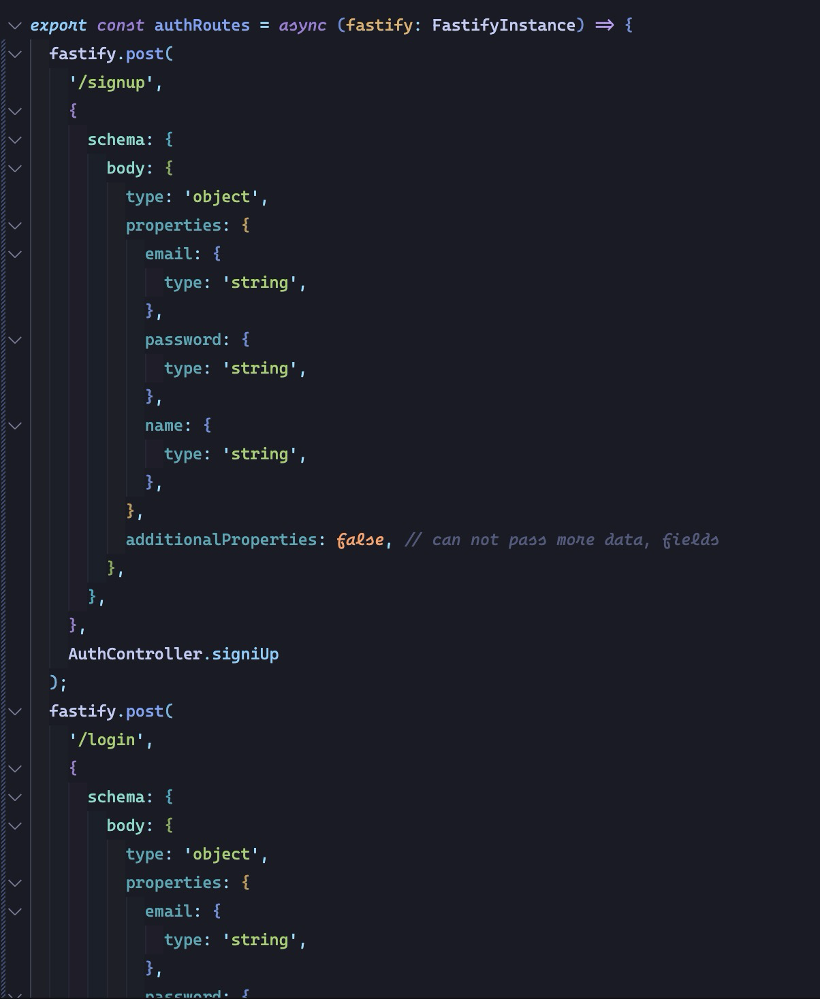
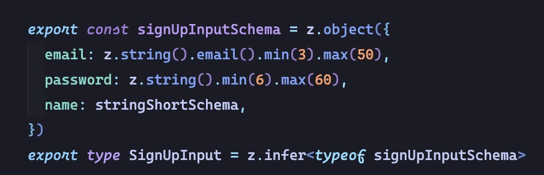

# Dokuemntacja

### Jak wystartować projekt
Należy otworzyć terminal w katalogiu projektu (czyli ten sam w którym znajduje się to README.md), a następnie zgodnie z komendami:
- skopiować pliki **env** do odpowiednich katalogów:
  - **.env.api** do katalogu `apps/api` i zmienić jego nazwę na **.env**
  - **.env.web** do katalogu `apps/web` i zmienić jego nazwę na **.env**
- zainsatlować pakiety `npm install`
- zbudować projekt `npm run build`
- oraz na sam koniec wystartować aplikację `npm run start`

### Walidacja
Walidacja danych na serwerze, jest wykonana wykorzystując natywnie wbudowaną opcję fastifyJS i JSON schema.
Przykład w pliku **apps/api/src/app/modules/customers/auth/auth.routes.ts**

Dodatkowo można zastosować bardziej skomplikowane parsowanie danych za pomocą biblioteki `zod`.
Np. sprawdzenie
Przykład w pliku **libs/shared/src/lib/modules/customers/auth/index.ts**

### Użyte technologie
**NX monorepo do zarządzania aplikacjami**
Nx to zaawansowane narzędzie do zarządzania monorepozytorium, które umożliwia organizację wielu aplikacji i bibliotek w jednym repozytorium.
Umożliwia dzielenie kodu, cache'owanie buildów, równoległe uruchamianie zadań i analizę zależności pomiędzy projektami.
Także w łatwy sposób można tworzyć npm-owe pakiety, które potem można udostępnić. W tym projekcie też takie npm-we paczki zostały stworzone

**Node.js z Fastify framework jako backend**
Fastify to szybki i lekki framework HTTP dla Node.js, który kładzie nacisk na wydajność i niskie zużycie zasobów.
Obsługuje m.in. pluginy, serializację odpowiedzi i automatyczne generowanie dokumentacji OpenAPI.

**Baza danych MongoDB**
MongoDB to nierelacyjna (NoSQL) baza danych typu dokumentowego, w której dane są przechowywane w formacie BSON (Binary JSON).
Dobrze sprawdza się w aplikacjach z dynamiczną strukturą danych.

**Autentykacja JWT**
JWT (JSON Web Token) to standard bezstanowej autentykacji, gdzie token zawiera zakodowane dane użytkownika oraz podpis.
Umożliwia autoryzację użytkowników bez konieczności trzymania sesji po stronie serwera.

**TypeScript**
TypeScript to nadzbiór JavaScriptu dodający statyczne typowanie.
Umożliwia wcześniejsze wykrywanie błędów, lepszą integrację z IDE oraz łatwiejsze utrzymanie dużych projektów dzięki
silnej typizacji i możliwości korzystania z interfejsów, typów złożonych i dekoratorów.

**Inversify dla dependency injection (wstrzykiwanie zależności)**
Inversify to kontener IoC (Inversion of Control) dla TypeScript/JavaScript, umożliwiający implementację dependency injection.
Pozwala na luźne powiązania między komponentami, co ułatwia testowanie jednostkowe i lepsze zarządzanie złożonością aplikacji.
Inne frameworki Node.js jak Nest.js utworozny przez polaków, opera się na architektórze IoC.

**Next.js frontend (React)**
Next.js to framework do budowy aplikacji React, który wspiera m.in. server-side rendering (SSR), static site generation (SSG),
routing oparty na strukturze plików i API routes.
Umożliwia tworzenie wydajnych aplikacji webowych z bardzo dobrą optymalizacją SEO i UX.

**Tailwind do stylowania i własna paczka komponentów na podstawie shadcn**
Tailwind CSS to narzędzie do utility-first CSS, które pozwala stylować komponenty bez pisania własnych klas CSS.
Dzięki temu stylowanie jest szybkie i spójne.
Framework także stworzony przez polaków.
Dodatkwo została użyta biblioteka używająca tailwind **shadcn/ui**. To kolekcja gotowych komponentów UI zbudowanych na Tailwindzie i Radix UI,
które można kopiować i dostosowywać.
Własna paczka komponentów oparta na shadcn pozwala na zachowanie spójności wizualnej i przyspiesza development frontendowy.

### Modele

